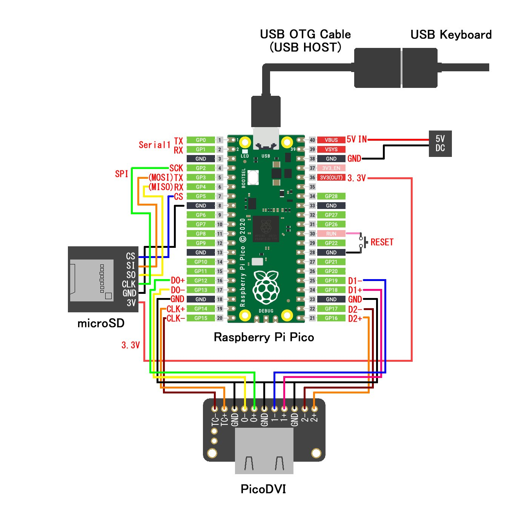

# RunCPM_Pico_DVI_USB_Keyboard
### Summary

This is a Raspberry Pi Pico (RP2040) ported version of RunCPM (Z80 CP/M emulator) that incorporates PicoDVI and USB Host (USB OTG) to support output to an HDMI display and input from a USB keyboard. 

Raspberry Pi Pico + microSD + HDMI Display (PicoDVI) + USB Keyboard (USB OTG) 
RunCPM (Z80 CP/M Emulator Arduino RP2040)

### 概要

これは、RunCPM (Z80 CP/M エミュレータ)の Raspberry Pi Pico (RP2040) 移植版に、PicoDVI と USB Host (USB OTG) を組み込んで、HDMIディスプレイへの出力とUSBキーボードからの入力に対応させたものです。

### 注意事項

私の環境では、一応それなりに動いています。ですが動作保証はしません。ユーザーサポートもしません。使用は自己責任で。何か問題があっても自分で何とかしてください。

私は商用のプログラムのコード等は書いたことが無い素人で初心者なので、多分、色々と間違っていると思います。 ここのソースコード内の私が書き代えた部分をプロの人やC/C++の熟練者が見たら「なんでこんなコードの書き方をするんだよ！」と怒りさえ覚える人がいるかもしれません。 もし居ましたら、これをフォークして、添削や清書をして頂ければと思います。

オープンソースなので、ライセンスの範囲内で自由に使ってください。遊んでみてください。

以下が元になっています。

RunCPM - Z80 CP/M emulator (オープンソースの Z80 CP/M エミュレータ) 
https://github.com/MockbaTheBorg/RunCPM

RunCPM for the Raspberry Pico (RunCPM の Raspberry Pi Pico 移植版) 
https://github.com/guidol70/RunCPM_RPi_Pico

RP2040 RunCPM Emulator with USB Keyboard & HDMI screen (Adafruit社の自社製品RP2040ボードを使用した作例) 
https://learn.adafruit.com/rp2040-runcpm-emulator-with-usb-keyboard-hdmi-screen
 

Adafruit の"[RP2040 RunCPM Emulator with USB Keyboard & HDMI screen](https://learn.adafruit.com/rp2040-runcpm-emulator-with-usb-keyboard-hdmi-screen)"を読んだ際に「これ、Raspberry Pi Pico 1枚で済むんじゃね？」と疑問に思って、作ってみたところ、出来ました。 
その時は動けばいいやで作っていたので、今回、中身を整理して公開することにしました。

基本的には、Adafruit の"[RP2040 RunCPM Emulator with USB Keyboard & HDMI screen](https://learn.adafruit.com/rp2040-runcpm-emulator-with-usb-keyboard-hdmi-screen)"と同じなので、まず先に、そちらをよーく読んでください（Arduino IDE やライブラリの設定、microSDカードに入れる CP/M ファイルの準備など）

### ハードウェア

Adafruit の作例では、RP2040搭載ボードを2枚、使用していますが、このスケッチ(プログラムソース)では、Raspberry Pi Pico を1枚だけ、使用します。
他には、
* microSDカードスロットボードと、microSDカード
* PicoDVIボード(HDMI映像出力用)と、HDMIディスプレイ
* USB OTG ケーブル(USBキーボード接続用)と、USBキーボード
* 5V電源

今回のプログラムソース(Arduinoスケッチ)では、下記のピンアサインになっています。(Serial1 の入出力が生きています、同時使用が出来ます)
   

Raspberry Pi Pico (RP2040) は、ピンアサインが比較的柔軟に設定できるので、各自の環境に合わせて書き直して使用してください。

### ソフトウェア
Adafruit の"[RP2040 RunCPM Emulator with USB Keyboard & HDMI screen](https://learn.adafruit.com/rp2040-runcpm-emulator-with-usb-keyboard-hdmi-screen)"の以下のプログラムソースを元にしています。

https://github.com/adafruit/Adafruit_Learning_System_Guides/tree/main/runcpm-rp2040-dvi-usb

Adafruit の作例では Pico-PIO-USB を使用していますが、動作周波数の関係で Pico-PIO-USB と PicoDVI は共存が出来ないので、RP2040(Raspberry Pi Pico のMCU)内蔵のUSBコントローラを USB Host で使用しています。

Arduino IDE で "RunCPM_v6_7_Pico_DVI_USB_Keyboard.ino" を読み込んで、以下の設定でコンパイルしてください。 
ツールの、
* ボード:"Raspberry Pi Pico" or "Raspberry Pi Pico 2"
* Optimize:"Optimize Even More (-O3)"
* USB Stack:"Adafruit TinyUSB Host (native)"
 ( "Adafruit TinyUSB Host" を選んでいるにも関わらず warning が出たりしますけれど大丈夫っぽいです)

※ぱいぴこの USB を USB HOST で使用すると、それ以降そのままでは USB からのスケッチ(プログラム)の書き込みが出来ません。 
スケッチを書き込む際は、ぱいぴこのUSBコネクタから USB OTG ケーブルを抜いて、BOOTSELボタンを押しながらPCのUSBケーブルを繋ぐか、PCのUSBケーブルを繋いだ状態でBOOTSELボタンを押しながらRESETボタンを押すと、Arduino IDE のシリアルポートに "UF2 Board" が現れるので、そこに書き込みを行ってください。 

※USBキーボードとDVI(HDMI)表示関係の変更は、RunCPM_v6_7_Pico_DVI_USB_Keyboard\hardware\pico\ にある "pico_sd_spi_dvi_usbkey.h" に詰め込んであります。PicoDVIのピンアサインの変更は"pico_sd_spi_dvi_usbkey.h"内の"DVItext1 display(DVI_RES_640x240p60, xxxx_cfg);"を書き換えてください。  

※2024/09/14：更新 
　コンパイルが通らなくなっていたので、久しぶりに少しメンテナンスしました。それに伴ってピンアサインを変更しました。Raspberry Pi Pico 2 (RP2350) でも動きます。ただし最低限の動作チェックしかしていません。コンパイル済みのUF2ファイルを置いておきます  

#### おまけ
元のプログラムソースでは英語キーボードの使用が前提になっていますが、今回おまけで日本語キーボードでの入力に対応させてみました。
RunCPM_v6_7_Pico_DVI_USB_Keyboard\hardware\pico にある "pico_sd_spi_dvi_usbkey.h" 内の「#include "keymapperUS.h"」を「#include "keymapperJP.h"」に書き代えると、日本語キーボード配列になります(記号等の入力が日本語キーボード準拠になります)。
